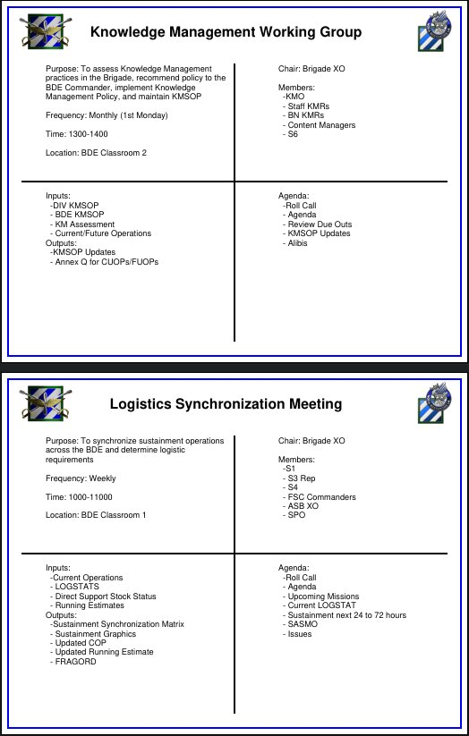

# Seven Minute Drill Generator
## Purpose
Application receives data on army  staff battle rhythm events and generates a 7-minute drill PDF.  Entered data is persistent (stored in data directory as a pickle binary stream.

## TODO:
- [ ] Fix: currently data manipulation can only be hard coded
- [ ] Create user interface as Flask Application
- [ ] Eliminate Hard Coded Image paths (make user preference in App)
- [ ] Eliminate Hard Coded Colors (make user preference in App)
- [ ] Add functionality to PDF Generation - Week Battle Rhythm Calendar
- [ ] Expand this list because there are a lot of subtasks to these tasks

